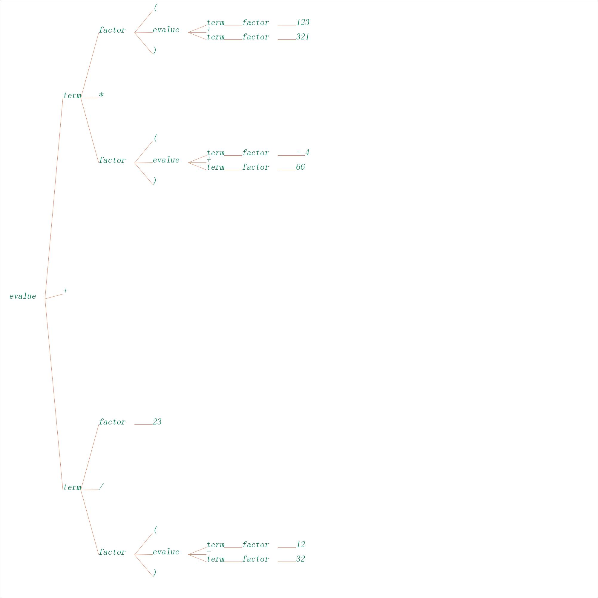

# 用编译原理的方式打开计算器

## 结果如下：

## 参考文章：

`https://zhuanlan.zhihu.com/p/24457041?refer=hinus`

## 主要文件

src/com/company处存放主要的代码

`AlgoFrame` : 是一个使用swing Graphics2D显示的框架，用于可视化。如果不需要动态显示则可忽略该文件。

`Expression`: 是实现递归下降的主要代码。

`InputTokenStream`: 使用适配器思想，用于读入字节流输出Token流，即词法分析代码。

`Main` : 测试程序的一些代码。

`Token` : 定义Token的类。

`TreeNode` : 通用的树，用于保存递归下降中间结果，实现了较强的可视化方法。

`Util` : 存放通用的工具方法。

